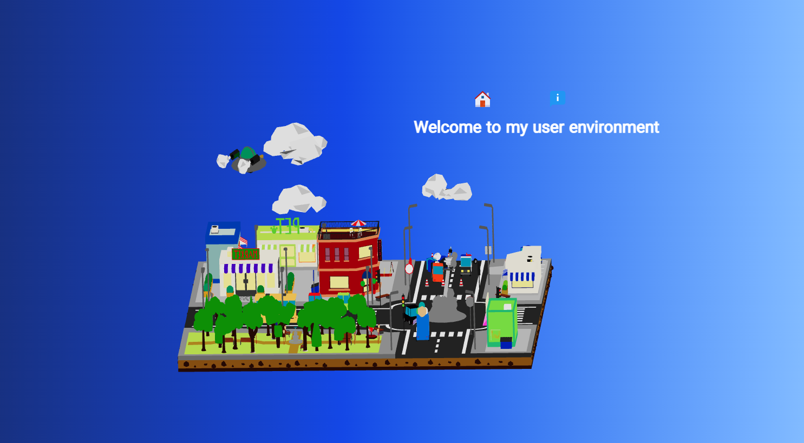

# 🌌 3D Portfolio Website

An interactive 3D portfolio website built with React, Three.js and Tailwind CSS.

🌐 Live Demo:

https://3d-portfolio-eli.vercel.app/

## 📌 Overview

A creative developer portfolio experience combining modern frontend development with interactive 3D elements.

The project demonstrates the use of Three.js for creating immersive web experiences.

## ✨ Features

- Interactive 3D environment
- Modern portfolio layout
- Smooth animations
- Responsive design
- Multi-page structure:
  - Home
  - Main
  - About

## 🛠 Technologies

- React
- Three.js
- Tailwind CSS
- Axios
- JavaScript

## 🚀 Highlights

- 3D web experience
- Creative UI development
- Interactive frontend animations
- Component-based architecture

## 👩‍💻 Author

Elham Barzegar

Front-End Developer

Portfolio:
https://elhambarzegar.ir
